# TranTest — Cross-Domain Active Learning Benchmark

**TranTest** is this working copy of the codebase. It implements a cross-domain benchmark for comparing active learning (AL) acquisition strategies in a Gym-style environment. The default **raw-image** path uses **DINOv3 (ViT)** as a backbone with a linear probe; an alternative **encoded** path uses a **SimCLR-style ResNet-18** encoder trained via the pretext task, then a linear or MLP head on frozen features.

Lineage: NeurIPS 2024 submission *"A Cross Domain-Benchmark for Active Learning"* (CSA-DINOv3-style fork). Licensed under [CC BY 4.0](https://creativecommons.org/licenses/by/4.0/).

---

## Table of Contents

- [Overview](#overview)
- [Model Architecture](#model-architecture)
- [Project Structure](#project-structure)
- [Dependencies](#dependencies)
- [Quick Start](#quick-start)
- [Configuration](#configuration)
- [Available Agents](#available-agents)
- [Available Datasets](#available-datasets)
- [Running Experiments](#running-experiments)
- [Results](#results)
- [Extending the Framework](#extending-the-framework)

---

## Overview

The framework repeatedly runs the following active learning loop:

1. **Initialize** a small seed-labeled set (per-class) and train a classifier.
2. An **acquisition agent** selects `query_size` samples from the unlabeled pool.
3. Selected samples are moved to the labeled set; the classifier is **retrained**.
4. Repeat until the annotation **budget** is exhausted.

Two classification pathways are supported:

| Pathway | Backbone | Classifier Head | Config Sections |
|---------|----------|-----------------|-----------------|
| **Raw data** (default) | DINOv3 ViT (frozen or finetuned) | Single linear layer | `dataset`, `classifier`, `optimizer` |
| **Encoded data** (`--encoded 1`) | SimCLR pretrained encoder | Linear or MLP | `dataset_embedded`, `classifier_embedded`, `optimizer_embedded` |

---

## Model Architecture

This section describes **which networks exist**, **how data flows through them**, and **where they are constructed**. Each run uses either the raw-image pathway or the encoded pathway (`evaluate.py` and `--encoded`), not both at once.

### Big picture

```mermaid
flowchart TB
  subgraph raw_path [Raw data pathway]
    X1[Dataset tensor] --> P1[Preprocess to ViT input]
    P1 --> V[DINOv3 ViT backbone]
    V --> H1[Linear probe]
    H1 --> L1[Class logits]
  end
  subgraph ssl [SimCLR pretraining]
    X2[Two augmented views] --> R[ResNet-18 trunk]
    R --> M[MLP projection head]
    M --> Z[L2-normalized features]
    Z --> NT[NT-Xent / memory bank]
  end
  subgraph enc_path [Encoded AL pathway]
    X3[Images or cached features] --> R2[Frozen SSL backbone]
    R2 --> H2[Linear or MLP head]
    H2 --> L2[Class logits]
  end
```



The **AL loop** (`core/environment.py`, `evaluate.py`) repeatedly fits the classifier on the current labeled pool; an **acquisition agent** (`agents/*`) scores unlabeled samples using the current model (logits, gradients, etc., depending on the agent).

### Pathway A — DINOv3 on raw pixels

- **Purpose**: Strong off-the-shelf visual features for AL on full-resolution inputs after resizing.
- **Backbone**: Hugging Face `AutoModel` from `classifier.model_name` (default DINOv3 ViT-B/16). If `freeze_backbone: true`, backbone weights are fixed and only the head updates.
- **Head**: `SeededLinear(hidden_size, num_classes)` in `DINOv3Classifier` (`classifiers/classifier.py`).
- **Forward path**: `DINOv3Classifier._preprocess` converts normalized CIFAR tensors toward `[0,1]`, applies ImageNet mean/std, resizes (default bicubic to `input_size` 224), runs the ViT, and takes the pooled / CLS representation before the linear head.
- **Configuration**: `dataset`, `classifier`, `optimizer` in `configs/*.yaml`.

### Pathway B — SimCLR-style encoder + probe

**Self-supervised encoder (pretext)**

1. `BaseDataset.get_pretext_encoder()` in `core/data.py` calls `construct_model(..., config["pretext_encoder"], add_head=False)`.
2. For CIFAR-10 YAML, `pretext_encoder.type` is **Resnet18** (`classifiers/resnet.py`): the **convolutional ResNet-18 body** without the final `linear` classifier. Global average pooling yields a **512-dimensional** vector; `encoder_dim` is stored on the config at runtime.
3. That backbone is wrapped in **`ContrastiveModel`** (`sim_clr/encoder.py`): **512 → MLP** (`Linear → ReLU → Linear`) to `pretext_encoder.feature_dim` (e.g. **128**) followed by **L2 normalization** on the projection. This is the standard SimCLR-style head used with contrastive loss in `sim_clr/loss.py` and training in `train_encoder.py`.
4. Augmentations come from each dataset’s `get_pretext_transforms` (e.g. `datasets/cifar10.py`: random crop/flip, color jitter, grayscale); optimization uses `pretext_optimizer`, batch size and epochs from `pretext_training`.

**Downstream / AL on frozen features**

- After SSL training, checkpoints are referenced from `dataset_embedded.encoder_checkpoint`. The environment encodes images (or loads cached embeddings), then trains **`classifier_embedded`**: usually **`LinearModel`** (single linear layer on feature vectors) or **`DenseModel`** (MLP), both from `construct_model` in `classifiers/classifier.py`.
- Agents interact with the same `forward` interface as in the raw pathway; the difference is the input dimensionality and that the backbone is typically fixed for encoded runs.

### Other classifier heads

`construct_model()` also wires **supervised ResNet-18 with head** (optional `pretrained_path` and `freeze_backbone`), **MLP** stacks (`DenseModel`), and **BiLSTM** for text datasets (`classifiers/classifier.py`).

### Quick reference — code locations

| Topic | Location |
|--------|-----------|
| Build SSL model (backbone + projection) | `core/data.py` → `get_pretext_encoder` |
| ResNet-18 trunk | `classifiers/resnet.py` |
| SimCLR projection + normalize | `sim_clr/encoder.py` → `ContrastiveModel` |
| DINOv3 + linear probe | `classifiers/classifier.py` → `DINOv3Classifier` |
| YAML-driven `type` dispatch | `construct_model()` in `classifiers/classifier.py` |
| AL environment step / retraining | `core/environment.py`, `evaluate.py` |

---

## Project Structure

```
TranTest/
├── evaluate.py                 # Main entry point — runs the AL loop
├── evaluate_oracle.py          # Greedy oracle baseline
├── compute_upper_bound.py      # Full-dataset upper bound
├── train_encoder.py            # SimCLR pretext task training
├── ray_tune.py                 # Hyperparameter optimization (Ray Tune)
├── experiment_util.py          # Device detection, path setup
├── download_all_datasets.py    # Batch dataset downloader
│
├── core/
│   ├── environment.py          # ALGame (gym.Env) — pool management & classifier training
│   ├── env_logging.py          # EnvironmentLogger — accuracy/loss CSV recording
│   ├── agent.py                # BaseAgent abstract class
│   ├── data.py                 # BaseDataset — data loading, seed set, encoding
│   └── helper_functions.py     # Name→class mappings, result collection, plotting utils
│
├── agents/                     # Acquisition strategy implementations
│   ├── random_agent.py         # Random sampling
│   ├── margin.py               # Margin score
│   ├── shannon_entropy.py      # Shannon entropy
│   ├── least_confident.py      # Least confident
│   ├── coreset.py              # CoreSet greedy
│   ├── badge.py                # BADGE
│   ├── bald.py                 # BALD (MC Dropout)
│   ├── typiclust.py            # TypiClust
│   ├── core_gcn.py             # CoreGCN
│   ├── surprise_adequacy.py    # DSA / LSA
│   └── galaxy.py               # Galaxy
│
├── classifiers/
│   ├── classifier.py           # construct_model() + DINOv3Classifier, Linear, MLP, etc.
│   ├── seeded_layers.py        # Reproducible weight initialization (SeededLinear, etc.)
│   ├── resnet.py               # ResNet-18 for SimCLR / pretext
│   └── lstm.py                 # BiLSTM for text datasets
│
├── datasets/                   # Dataset implementations (each inherits BaseDataset)
│   ├── cifar10.py
│   ├── mnist.py
│   ├── fashion_mnist.py
│   ├── usps.py
│   ├── splice.py
│   ├── dna.py
│   ├── topv2.py
│   ├── news.py
│   └── sythData.py             # Toy datasets (ThreeClust, DivergingSin, LargeMoons)
│
├── configs/                    # YAML configuration per dataset
│   ├── cifar10.yaml
│   ├── mnist.yaml
│   ├── fashionmnist.yaml
│   └── ...
│
├── sim_clr/                    # SimCLR self-supervised learning
│   ├── training.py
│   ├── loss.py
│   ├── encoder.py
│   ├── data.py
│   ├── optim.py
│   ├── memory.py
│   └── evaluate.py
│
├── raytune/                    # Ray Tune search spaces
├── results/                    # Post-hoc analysis & plotting scripts
├── runs/                       # Experiment outputs (auto-generated)
└── run_agents.sh               # Slurm batch script for running multiple agents
```

---

## Dependencies

**Python >= 3.10**

```bash
pip install torch torchvision gym matplotlib pandas scikit-learn \
    faiss-cpu nltk pyyaml transformers batchbald-redux huggingface-hub
# Optional
pip install "ray[tune]"
pip install medmnist   # PathMNIST (`--dataset pathmnist`)
```

> For text datasets (News / TopV2), NLTK tokenizer data is also needed:
> ```python
> import nltk; nltk.download('punkt')
> ```

---

## Quick Start

### 1. Download datasets (optional, auto-downloaded on first run)

```bash
python download_all_datasets.py --data_folder data_lib
```

### 2. Run a single experiment

```bash
python evaluate.py \
    --data_folder data_lib \
    --agent random \
    --dataset cifar10 \
    --query_size 10 \
    --restarts 5
```

### 3. Run multiple agents via Slurm

```bash
sbatch run_agents.sh cifar10 10 20 data_lib
```

---

## Configuration

Each dataset has a YAML file in `configs/`. The file contains parallel config blocks for the two classification pathways:

```yaml
# --- Raw-data pathway (DINOv3) ---
dataset:
  budget: 200                         # Total samples to label
  classifier_fitting_mode: finetuning # finetuning | from_scratch
  initial_points_per_class: 2         # Seed set size per class
  classifier_batch_size: 64
  validation_split: 0.04

classifier:
  type: DINOv3
  model_name: facebook/dinov3-vitb16-pretrain-lvd1689m
  freeze_backbone: True               # Freeze ViT, only train head
  input_size: 224

optimizer:
  type: NAdam
  lr: 0.001
  weight_decay: 0.0

# --- Encoded-data pathway (SimCLR features) ---
dataset_embedded:
  encoder_checkpoint: encoder_checkpoints/cifar10_27.03/model_seed1.pth.tar
  budget: 450
  classifier_fitting_mode: from_scratch
  initial_points_per_class: 1
  classifier_batch_size: 64

classifier_embedded:
  type: Linear                        # or MLP with hidden: [24, 12]

optimizer_embedded:
  type: NAdam
  lr: 0.00171578341563099
  weight_decay: 2.38432342659786E-05
```

---

## Available Agents

| Name (CLI) | Class | Strategy |
|------------|-------|----------|
| `random` | `RandomAgent` | Uniform random sampling |
| `margin` | `MarginScore` | Smallest margin between top-2 predictions |
| `entropy` | `ShannonEntropy` | Maximum predictive entropy |
| `leastconfident` | `LeastConfident` | Lowest maximum class probability |
| `coreset` | `Coreset_Greedy` | Greedy core-set distance maximization |
| `badge` | `Badge` | Gradient embedding + k-means++ |
| `bald` | `BALD` | Bayesian AL by Disagreement (MC Dropout) |
| `typiclust` | `TypiClust` | Typicality-based clustering |
| `coregcn` | `CoreGCN` | Graph convolutional network selector |
| `dsa` | `DSA` | Distance-based Surprise Adequacy |
| `lsa` | `LSA` | Likelihood-based Surprise Adequacy |
| `galaxy` | `Galaxy` | Galaxy acquisition function |

---

## Available Datasets

| Domain | Name (CLI) | Classes |
|--------|-----------|---------|
| Image | `cifar10` | 10 |
| Image | `mnist` | 10 |
| Image | `fashionmnist` | 10 |
| Tabular | `usps` | 10 |
| Tabular | `splice` | 3 |
| Tabular | `dna` | 3 |
| Text | `topv2` | 7 |
| Text | `news` | 15 |

Toy datasets (`threeclust`, `divergingsin`, `largemoons`) are also available for debugging.

---

## Running Experiments

### CLI Arguments

| Argument | Default | Description |
|----------|---------|-------------|
| `--data_folder` | (required) | Directory for dataset files |
| `--agent` | `galaxy` | Acquisition strategy name |
| `--dataset` | `topv2` | Dataset name |
| `--query_size` | `50` | Samples selected per AL round |
| `--encoded` | `0` | Use SimCLR-encoded features (`1`) or raw data (`0`) |
| `--run_id` | `1` | Starting seed / run identifier |
| `--restarts` | `50` | Number of sequential repetitions |
| `--agent_seed` | `1` | Random seed for agent |
| `--pool_seed` | `1` | Random seed for pool shuffling |
| `--model_seed` | `1` | Random seed for classifier initialization |
| `--strict_deterministic` | `1` | Enable full CUDA determinism |
| `--experiment_postfix` | `None` | Suffix appended to result folder name |

### Parallelism

Controlled by `run_id` and `restarts`:

- **Sequential**: `--run_id 1 --restarts 50` runs 50 repetitions in one process.
- **Fully parallel**: Launch 50 jobs each with `--restarts 1` and `--run_id` from 1 to 50.

Results are automatically aggregated into `runs/<Dataset>/<query_size>/<Agent>/accuracies.csv`.

### Training a SimCLR Encoder

```bash
python train_encoder.py --data_folder data_lib --dataset cifar10 --seed 1
```

The checkpoint is saved and referenced in the YAML's `dataset_embedded.encoder_checkpoint`.

---

## Results

- Per-run outputs: `runs/<Dataset>/<query_size>/<Agent>/run_<id>/accuracies.csv`
- Aggregated outputs: `runs/<Dataset>/<query_size>/<Agent>/accuracies.csv`
- Analysis scripts in `results/`: learning curve plots, CD diagrams, cold-start detection, gain heatmaps.

---

## Extending the Framework

### Adding a New Agent

1. Create `agents/my_agent.py` inheriting from `core.agent.BaseAgent`.
2. Implement `predict(x_unlabeled, x_labeled, y_labeled, per_class_instances, budget, added_images, initial_test_acc, current_test_acc, classifier, optimizer) -> list[int]`.
3. Register it in `agents/__init__.py` and `core/helper_functions.py:get_agent_by_name`.

### Adding a New Dataset

1. Create `datasets/my_data.py` inheriting from `core.data.BaseDataset`.
2. Implement `_download_data()`, `load_pretext_data()`, `get_pretext_transforms()`, `get_pretext_validation_transforms()`.
3. Add a YAML config in `configs/` and register in `datasets/__init__.py` and `core/helper_functions.py:get_dataset_by_name`.

### Adding a New Classifier

1. Add a new `nn.Module` class in `classifiers/classifier.py`.
2. Add a branch in `construct_model()` keyed by a new `type` string.
3. Set `classifier.type` in the YAML to use it.
